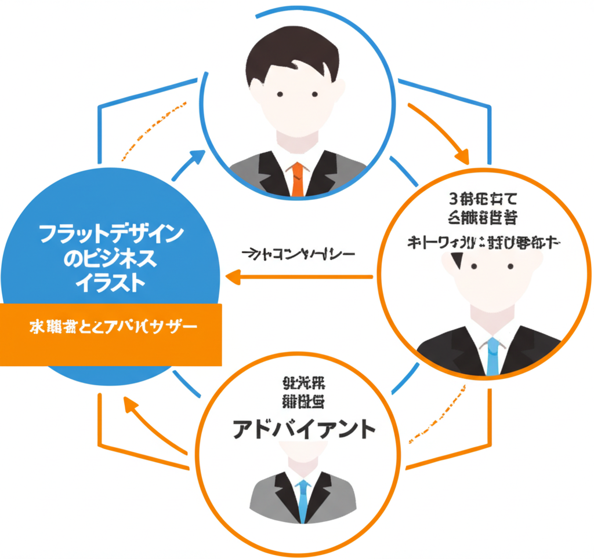
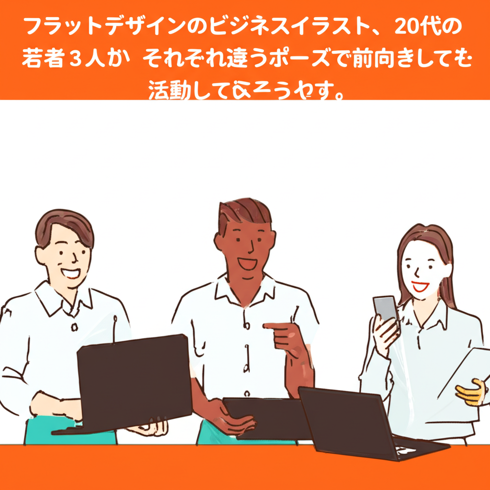

# 転職エージェントおすすめ5選｜20代・第二新卒向け

転職エージェントを使ってみたいけど、数が多すぎてどれを選べばいいかわからない。20代や第二新卒だと、そもそも相手にしてもらえるのか不安になりますよね。

結論から言うと、20代の転職にはエージェントの活用が有効です。厚生労働省の調査によると、転職入職者のうち20〜24歳の割合は男性で14.7%、女性で10.9%と、若年層の転職は年々増えています。ただし、エージェントごとに得意領域が異なるため、自分に合ったサービスを選ぶことが大切です。

この記事では、20代・第二新卒に向いている転職エージェントのおすすめ5選と、失敗しない選び方のポイントを紹介します。

---

**目次**
- [転職エージェントとは？仕組みをかんたんに解説](#転職エージェントとは仕組みをかんたんに解説)
- [20代が転職エージェントを使うべき3つの理由](#20代が転職エージェントを使うべき3つの理由)
- [20代・第二新卒におすすめの転職エージェント5選](#20代第二新卒におすすめの転職エージェント5選)
- [自分に合った転職エージェントの選び方](#自分に合った転職エージェントの選び方)
- [転職エージェント利用時の注意点](#転職エージェント利用時の注意点)
- [まとめ](#まとめ)

---

## 転職エージェントとは？仕組みをかんたんに解説

転職エージェントとは、求職者と企業の間に立って転職活動をサポートしてくれるサービスです。担当のキャリアアドバイザーがつき、求人紹介から面接対策、年収交渉まで一貫して支援してくれます。

### 転職サイトとの違い

転職サイトは自分で求人を検索して応募する「セルフサービス型」です。一方、転職エージェントはアドバイザーが求人を選んで提案してくれる「伴走型」のサービスです。

主な違いを整理すると以下の通りです。

| 項目 | 転職サイト | 転職エージェント |
|------|----------|----------------|
| 求人の探し方 | 自分で検索・応募 | アドバイザーが紹介 |
| 非公開求人 | なし | あり |
| 書類添削・面接対策 | なし | あり |
| 年収交渉 | 自分で行う | アドバイザーが代行 |
| 料金 | 無料 | 無料 |

転職エージェントの料金は、企業側が採用成功時に支払う仕組みです。求職者は最初から最後まで無料で利用できます。

### 非公開求人が多い理由

転職エージェントが保有する求人の約60〜80%は、転職サイトに掲載されない非公開求人です。企業が非公開にする理由は、採用コストの効率化や競合に知られたくないといった事情があります。

エージェントを利用しないと、こうした求人にはそもそもアクセスできません。

---

## 20代が転職エージェントを使うべき3つの理由

### 理由1：キャリアの方向性を一緒に考えてもらえる

20代、特に第二新卒の時期は「自分に何が向いているのかわからない」と感じる方が多いです。転職エージェントのアドバイザーは、これまでの経験や希望をヒアリングしたうえで、キャリアの方向性を一緒に考えてくれます。

「なんとなく今の仕事が合わない」という漠然とした状態でも、対話を通じて整理できるのがエージェントの強みです。

### 理由2：書類選考の通過率が上がる

20代は職務経歴が浅いぶん、書類選考でのアピールが難しくなります。エージェントは企業ごとに「どんな書き方が響くか」を熟知しているため、書類の通過率が上がりやすいです。

実際に、エージェント経由の応募は書類通過率が約30〜50%と言われています。自己応募の場合は10〜20%程度なので、差は大きいです。

### 理由3：入社後のミスマッチを防げる

求人票だけではわからない職場の雰囲気や、残業の実態、上司のマネジメントスタイルといった情報をアドバイザーから聞けます。入社してから「思っていたのと違った」となるリスクを減らせます。

20代は今後のキャリアの土台を作る時期です。ミスマッチの少ない転職をするためにも、エージェントの情報は役に立ちます。

---

## 20代・第二新卒におすすめの転職エージェント5選

20代・第二新卒向けの転職エージェントを、特徴別に5つ紹介します。

### 1. リクルートエージェント

**特徴**：業界最大級の求人数。幅広い業種・職種をカバーしており、選択肢を広げたい人向け。

- 公開求人数：約40万件以上
- 非公開求人：約30万件以上
- 対応エリア：全国
- 得意領域：全業界・全職種

求人数が圧倒的に多いため、「まだ業界や職種を絞り込めていない」という20代に向いています。ただし、担当者の経験にばらつきがある点は留意しておきましょう。

### 2. マイナビジョブ20's

**特徴**：20代・第二新卒に特化したエージェント。未経験歓迎の求人が豊富。

- 対象年齢：20代限定
- 未経験歓迎求人：全体の約75%以上
- 対応エリア：全国（首都圏・関西が中心）
- 得意領域：営業、IT、事務、販売

20代専門なので、アドバイザーも若手のキャリア支援に慣れています。「社会人経験が浅い」「異業種にチャレンジしたい」という方に適しています。

### 3. doda

**特徴**：転職サイトとエージェントの両機能を備える。自分でも探しつつ、紹介も受けたい人向け。

- 公開求人数：約25万件以上
- 対応エリア：全国
- 得意領域：IT、メーカー、営業職

サイトで気になる求人を見つけて、エージェントに相談するという使い方ができます。自分のペースで進めたい20代に向いています。

### 4. ハタラクティブ

**特徴**：フリーター・既卒・第二新卒の就職支援に強み。経歴に自信がない方向け。

- 内定率：約80%
- 対応エリア：首都圏、関西、東海、福岡
- 得意領域：未経験OKの正社員求人

「正社員経験がない」「短期離職してしまった」という方でも利用しやすいサービスです。カウンセリングが丁寧で、一人ひとりに合った求人を紹介してくれます。

### 5. UZUZ（ウズウズ）

**特徴**：第二新卒・既卒に特化。一人あたり平均12時間の手厚いサポートが特徴。

- 入社後の定着率：約96%
- 対応エリア：首都圏、関西
- 得意領域：IT、Web、営業

キャリアカウンセリングに時間をかけるスタイルのため、「じっくり相談したい」という方に合っています。ブラック企業を排除する独自基準を設けている点も安心材料です。

---

## 自分に合った転職エージェントの選び方

### ステップ1：自分の状況を整理する

まず、以下のどれに当てはまるかを確認しましょう。

- **幅広く求人を見たい** → 総合型（リクルートエージェント、doda）
- **20代向けのサポートがほしい** → 特化型（マイナビジョブ20's、UZUZ）
- **経歴に不安がある** → 未経験向け（ハタラクティブ）

### ステップ2：2〜3社に登録する

1社だけに絞ると、担当アドバイザーとの相性が合わなかった場合に行き詰まります。**総合型1社＋特化型1〜2社**の組み合わせで登録するのがおすすめです。

複数のエージェントを使うことで、紹介される求人の幅が広がり、アドバイザーの質を比較することもできます。

### ステップ3：初回面談で判断する

登録後の初回面談で、以下のポイントを確認しましょう。

- こちらの話をしっかり聞いてくれるか
- 希望と合わない求人を押し付けてこないか
- 業界や職種に対する知識があるか
- 転職を急かさず、自分のペースを尊重してくれるか

合わないと感じたら、担当変更を依頼するか、別のエージェントに切り替えれば問題ありません。

---

## 転職エージェント利用時の注意点

### 希望条件は正直に伝える

「こんなことを言ったら求人が減るかも」と遠慮して条件を伝えないと、ミスマッチの原因になります。年収、勤務地、残業時間、やりたい仕事など、希望条件は率直に共有しましょう。

### 紹介された求人をすべて受ける必要はない

エージェントから紹介された求人に、必ず応募しなければならないわけではありません。興味がない場合は、理由を添えて断れば問題ないです。断る理由を伝えることで、次の提案の精度が上がります。

### 複数エージェント利用は隠さない

複数のエージェントを利用していることは、各アドバイザーに伝えておきましょう。スケジュール調整がしやすくなりますし、同じ企業に重複して応募するトラブルも防げます。

---

## まとめ

20代・第二新卒の転職では、自分の状況に合ったエージェントを選ぶことが成功のカギです。経歴が浅くても、エージェントのサポートを受けることで選考の通過率は上がります。

**この記事のポイント：**
- 転職エージェントは無料で利用でき、非公開求人にアクセスできる
- 20代は「総合型1社＋特化型1〜2社」の複数登録がおすすめ
- 初回面談でアドバイザーとの相性を確認し、合わなければ変更する

「自分に合ったエージェントがどれかわからない」「まずはキャリアの方向性から相談したい」という方は、まずは無料相談から始めてみてください。当社のキャリアアドバイザーが、あなたの経験や希望に合わせた求人をご紹介します。

**[無料でキャリア相談をする →](#)**

---

## 内部リンク候補

| 設置箇所 | リンク先の記事テーマ |
|---------|-------------------|
| 「書類選考の通過率が上がる」付近 | 職務経歴書の書き方（20代向け） |
| 「年収交渉」の表内 | 転職で年収アップするコツ |
| 「異業種にチャレンジしたい」付近 | 未経験転職の成功事例 |
| まとめセクション | 転職活動の始め方ガイド |

---

## 画像一覧

| # | 挿入箇所 | ファイル名 | 生成プロンプト | alt属性 |
|---|---------|----------|--------------|---------|
| 1 | アイキャッチ | agent-recommend-01-eyecatch.png | 20代の若い求職者がキャリアアドバイザーとオンラインで面談している様子 | 転職エージェントのアドバイザーとオンラインで面談する20代の求職者 |
| 2 | H2:仕組み解説 | agent-recommend-02-mechanism.png | 求職者・アドバイザー・企業の3者がつながっている関係図 | 求職者・キャリアアドバイザー・企業の3者がつながる転職エージェントの仕組み |
| 3 | H2:3つの理由 | agent-recommend-03-reasons.png | 20代の若者3人がそれぞれ違うポーズで前向きに活動している様子 | 20代の求職者がそれぞれの方法で前向きに転職活動する様子 |
| 4 | H2:選び方 | agent-recommend-04-howto-choose.png | 虫眼鏡で3つの選択肢カードを比較検討するビジネスパーソン | 転職エージェントの選択肢を比較検討する求職者 |
| 5 | CTA付近 | agent-recommend-05-cta.png | キャリアアドバイザーと若い求職者が握手、上向き矢印やチェックマーク | キャリアアドバイザーと求職者が握手する転職成功のイメージ |

---

## 改善メモ

- **公開後に追加すべきデータ**：自社エージェント利用者の転職成功率、年収アップの実績データ、利用者の声（体験談）
- **画像の改善**：02（仕組み図）と03（理由）にテキストが含まれているため、Nano Banana Proでテキストなし版を再生成するか、デザイナーが手動修正する
- **図解化すべき箇所**：転職サイトとエージェントの違い（比較表をインフォグラフィックに）、おすすめ5選の比較チャート
- **リライト時の改善ポイント**：各エージェントの求人数を最新データに更新する、実際の利用者インタビューを追加する、「よくある質問（FAQ）」セクションの追加を検討する
